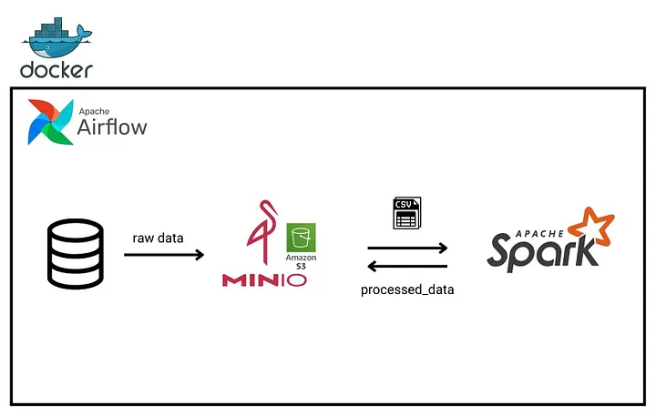

# Data Analysis Using Docker, Spark, Airflow, and MinIO


This project offers a powerful and flexible solution for creating a data analysis workflow using Docker, Spark, Airflow, and MinIO technologies. The aim of the project is to load two CSV files that make up the dataset from MinIO, analyze the dataset using Spark, and save the results back to MinIO.



## 🛠 Technologies and Methodology Used


1. A script was written in Python using PySpark. This script reads data from MinIO every 10 minutes with Airflow scheduler support, performs data analysis using Apache Spark, and saves the results to MinIO.
2. A custom Docker image containing the latest Java and PySpark libraries was created using the apache/airflow:2.9.3 base image. JAR files containing connection libraries compatible with AWS's disk product S3 were also added to this image for MinIO access.

3. The project was developed and tested with the following versions:


| Software       | Version      |
|----------------|--------------|
| OpenJDK        | `17.0.2`     |
| Docker         | `25.0.3`     |
| Docker Compose | `2.24.6`     |
| Spark          | `3.5.1`      |
| Hadoop         | `3`          |
| PySpark        | `3.5.1`      |
| Python         | `3.12.4`     |
| Airflow        | `2.9.3`      |
| MinIO          | `2024.7.16`  |


# 🚀 Running the Application
## 1. Creating the Custom Airflow Image

    $ cd python_spark_airflow_aws_s3_minio/src/
    $ docker build --rm -t docker-airflow-custom1:latest .  

## 2. Running the Application with Docker Compose
To start the containers:

    $ cd python_spark_airflow_aws_s3_minio/
    $ docker-compose up -d

To stop the containers after operation:

    $ docker-compose down


## Uploading data to the MinIO Webserver

[http://localhost:9001](http://localhost:9001)

Username and password to access the MinIO webserver: 

``` User: minioadmin``` <br> ``` Pass: minioadmin```

After accessing the MinIO webserver, a bucket named `data` must be created.
The files "person_data.csv" and "country_data.csv" should be uploaded to this bucket.

## Accessing the Airflow Webserver

[http://localhost:8060](http://localhost:8060)

Username and password to access the Airflow webserver: 

``` User: airflow``` <br> ``` Pass: airflow```

DAG files added to the python_spark_airflow_aws_s3_minio/dags folder will automatically be displayed in the airflow webserver.
These files can be activated and run from the web interface. By activating the "data_processing_dag.py" file from this interface,
you can check the results in the data directory located in the MinIO webserver.

DAG files added to the `python_spark_airflow_aws_s3_minio/dags` folder will automatically be displayed in the Airflow webserver.
These files can be activated and run from the web interface. By activating the `data_processing_dag.py` file from this interface,
you can check the results in the `data` directory located in the MinIO webserver.

## Access Information 

| Application    | URL                                            | Username and password                               |
|----------------|------------------------------------------------|------------------------------------------------------|
| Airflow        | [http://localhost:8060](http://localhost:8085) | ``` User: airflow``` <br> ``` Pass: airflow```       |         |
| MinIO          | [http://localhost:9001](http://localhost:9001) | ``` User: minioadmin``` <br> ``` Pass: minioadmin``` |           |
| Postgres       | **Server/Database:** localhost:5432/airflow    | ``` User: airflow``` <br> ``` Pass: airflow```       |           | 

